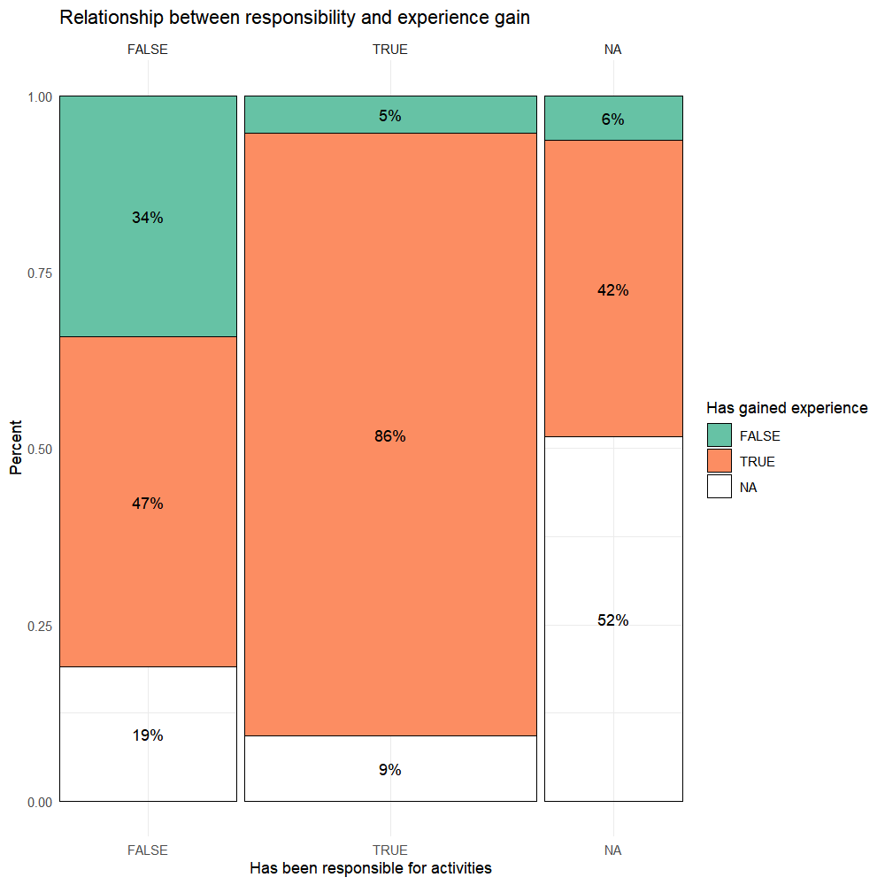

As part of their commitment to knowledge-based development in youth work policy and practice, [KEKS](https://www.keks.se/in-english) has developed a web-based system for documentation and follow-up called The Logbook. This platform is used to collect statistics and conduct surveys with young people. In 2024 alone, 119,772 activities were registered in the system, and more than 13,000 young people responded to the surveys. This generates a substantial amount of data, enabling local youth workers to develop their practice in a data-driven way, and allowing KEKS to present evidence-based reports on outcomes and engage in informed advocacy at the national level.

However, The Logbook only reports summary statistics on responses, with no detailed breakdown by background factors. For more detailed analysis -- such as examining subgroup responses or identifying correlations between questions -- external expertise is needed, which I’ve been providing over the past several years.

One particularly interesting analysis I did recently was of how demographic background variables, such as age and gender, affect outcome variables like perceived safety. Until now, this question had only been assessed by a simple pairwise comparison of the means -- so, for example, the mean perceived safety among visitors with parents born outside of Sweden is higher than in the other group -- but a regression analysis revealed that, controlling for age, gender, and having passing school grades, ethnicity is not a significant variable.

These analyses contributed to the forthcoming report "The Youth Centre: Myth and Reality", which will be available online in May 2025.

<!--more-->
